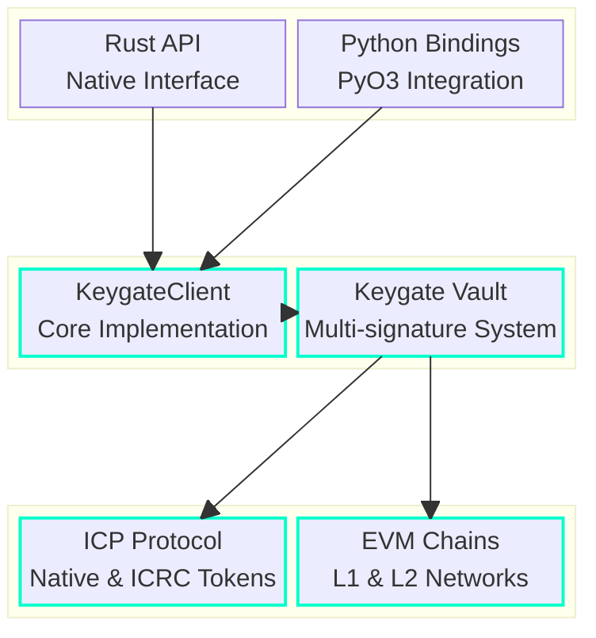
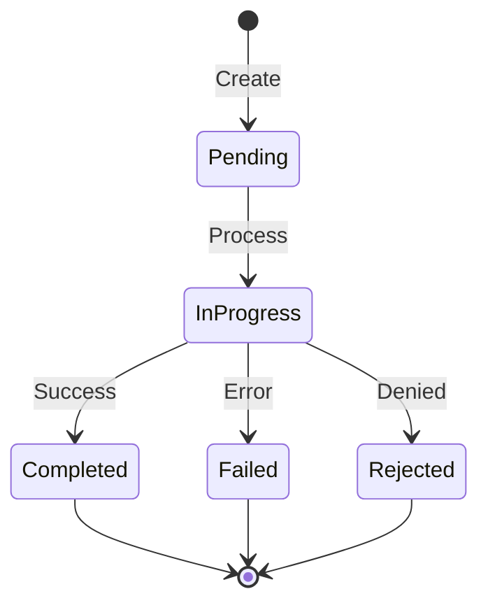

> This SDK is **stable** and ready for production use. For support, please open an issue in this repository.

[](https://internetcomputer.org)
[](LICENSE)


# Keygate SDK

A comprehensive Rust SDK for the Internet Computer Protocol (ICP), enabling seamless integration with Keygate's multisignature infrastructure. Create and manage ICP wallets, handle transactions, and build secure multi-party applications with ease.

## Overview

Keygate SDK provides a type-safe, efficient interface to interact with the Keygate ecosystem on the Internet Computer Protocol. Built with Rust's robust type system and async capabilities, it offers both low-level access to ICP operations and high-level abstractions for common wallet management tasks.

## System Architecture



## Features

- 🔐 **Secure Wallet Management**
  - Create and manage ICP and Ethereum L1 and L2 wallets
  - Optional CSV logging for wallet tracking
  - Multi-signature support
  
- 💰 **Transaction Operations**
  - Balance checking
  - Transaction execution
  - Status tracking
  
- 🔄 **Cross-Language Support**
  - Native Rust implementation
  - Python bindings via PyO3

## Quick Start

Add to your `Cargo.toml`:
```toml
[dependencies]
keygate-sdk = "0.1.0"
```

### Basic Usage

```rust
use keygate_sdk::{KeygateClient, load_identity};

#[tokio::main]
async fn main() {
    // Initialize client
    let identity = load_identity("path/to/identity.pem").await?;
    let client = KeygateClient::new(identity, "https://your-keygate-url").await?;

    // Create a wallet
    let wallet_id = client.create_wallet().await?;
    
    // Execute a transaction
    let transaction = TransactionArgs {
        to: "recipient_account_id".to_string(),
        amount: 1.5, // Amount in ICP
    };
    
    let status = client
        .execute_transaction(&wallet_id.to_string(), &transaction)
        .await?;
}
```

## Transaction Lifecycle



## API Reference

### Wallet Operations
```rust
// Create wallet with logging
let wallet_id = client.create_wallet_write_file().await?;

// Get account information
let account_id = client.get_icp_account(&wallet_id).await?;
let balance = client.get_icp_balance(&wallet_id).await?;
```

### Python Integration
```python
from keygate_sdk import KeygateClient

client = KeygateClient.from_pem("identity.pem", "https://keygate-url")
wallet_id = client.create_wallet()
```

## Development Setup

### Prerequisites

- Rust 1.54+
- Cargo
- ICP identity
- Keygate access

### Build and Test

```bash
# Build the SDK
cargo build --release

# Run tests
cargo test

# Build Python wheels
cargo build --features python-bindings
```

## Contributing

We welcome contributions! Please see our [Contributing Guidelines](CONTRIBUTING.md) for details.

## License

This project is licensed under the MIT License - see the [LICENSE](LICENSE) file for details.

## Support

- 📖 [Documentation](https://docs.keygate.io)
- 💬 [Discord Community](https://discord.gg/keygate)
- 📧 [Email Support](mailto:support@keygate.io)

---

<div align="center">
  
**[Website](https://keygate.io)** | **[Documentation](https://docs.keygate.io)** | **[Examples](./examples)**

</div>
